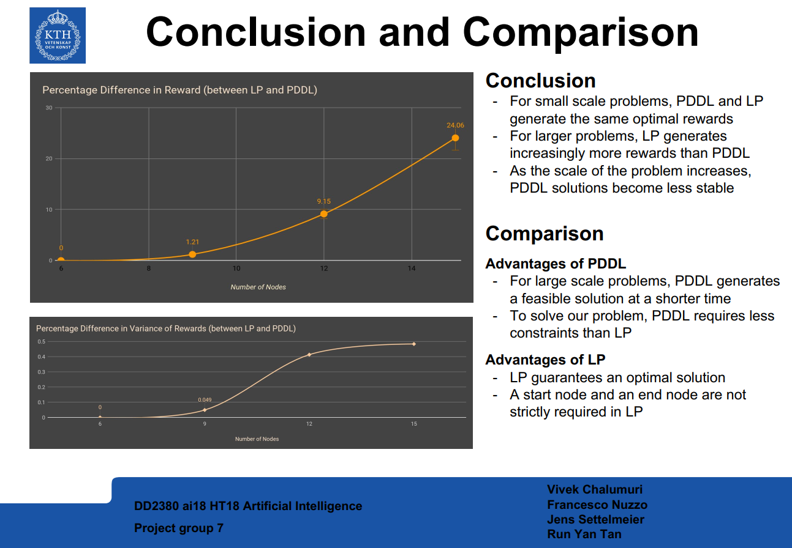

# Tourist Problem

This project is part of the course DD2380 Artificial Intelligence at KTH. In this project we compare PDDL (Planning Domain Definition Language) and Linear Programming for solving a versions of cost-constrained traveling salesman problem. 

In this project we consider a traveling tourist, who just arrived in a city.Without loss of generality we assume this city is Stockholm. Our tourist, named Hans, has a budget of time T, which will limit his time to travel in Stockholm. Time (t) for travelling and visiting a place would be subtracted from his budget everytime he visits a place. Based on the popularity of the location evey place has a popularity score (r) given by previous visitors. By staying within the given time budget, we want to maximize his experience score which is the sum of popularity scores of all the places he visits.

**Team Members**: Chalumuri, Vivek (vivekc@kth.se) | Nuzzo, Francesco (fnuzzo@kth.se) | Settelmeier, Jens (jensset@kth.se) | Tan, Run Yan (rytan@kth.se)
## Project Technical Details 

The main file is main.py.

The folder "src" is a package containing some modules.

usage: main.py     [-h]      [-n NUMBER_OF_NODES]   [-sn STARTING_NODE]  [-en ENDING_NODE]  [-b BUDGET]  [-s SEED]

optional arguments:

  - -h, --help            show this help message and exit
  - -n NUMBER_OF_NODES, --number_of_nodes NUMBER_OF_NODES
                        Number of nodes of the graph
  - -sn STARTING_NODE, --starting_node STARTING_NODE
                        First node of the path. Set to -1 if you don't want
                        any fixed starting node
  - -en ENDING_NODE, --ending_node ENDING_NODE
                        Last node of the path. Set to -1 if you don't want any
                        fixed starting node
  - -b BUDGET, --budget BUDGET
                        Total time available for visiting the nodes
  - -s SEED, --seed SEED  Random seed for generating a specific instance of the
                        problem

We use the IBM Cplex solver with Academic License. The Community Edition has 1000 constraints limit (around n=9).

The ModelInterface is a wrapper for managing both lp and pddl.

pddl_generator.py is used to generate a pddl file that we solve with LPG solver separately.

In utilities.py we generate a graph used for both pddl and lp.

LpModelInterface.py formulates and solves the problem in linear programming.

## Project Conclusions

